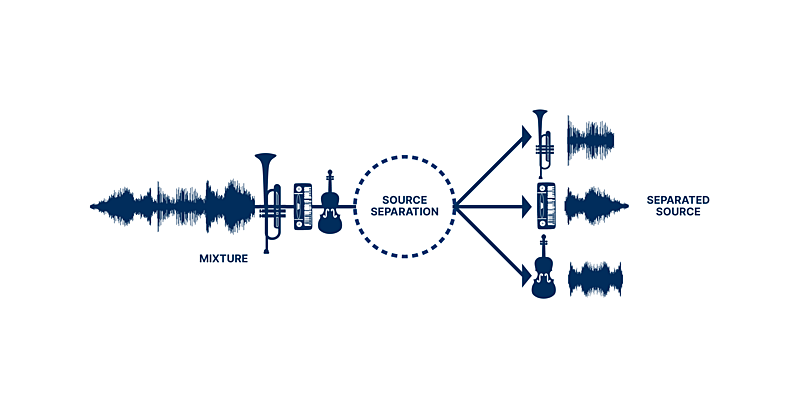
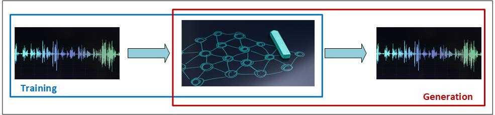

# Audio Source Separation

 

## Project context
Audio source separation is a technique that involves disintegrating a composite sound, like a concerto, into its constituent elements, such as the tracks for piano and violin. Here are some typical use cases that I've found useful for my own music endeavors:
- __Music Transcription__: Source separation can assist in the automatic transcription of music, where algorithms can more accurately transcribe notes from isolated sources than from mixed music.
- __Remixing and/or remastering__: one can separate and extract elements from composite musical tracks to remix music, create new arrangements, or enhance the clarity of individual instruments. One can also isolate and remove certain instruments or sounds to clean up old recordings, or update tracks with new instrumentals.
- __AI Training__: Clean, isolated tracks can serve as high-quality datasets for training AI models in tasks such as instrument recognition, music generation, and more.

## Project objective
My project revolved around investigating different methods of representing audio signals (as the dataset for AI model) and evaluating the possibility of using AI models for sound separation.

## Technology investigations
Considering my novice status in the AI field, I opted to begin my exploration with a Feedforward Neural Network (FNN) model, drawn by its relative simplicity and ease of understanding. 

To create the training dataset, I merged my piano recordings with a violin soundtrack. 

### Initial Exploration Using FNN
I focused on training the model in the sound wave format. My Google Colab notebook can be found at[Piano Sound Wave with FNN](https://github.com/JeffreyLuo333/Audio-Source-Separation/blob/main/notebooks/PianoSoundWaveFNN.ipynb).

The initial experimentation saw unsatisfactory results. Sounds from one source often "bleed" into the track of another, leading to a lack of clarity. 

### Preliminary work on wave-to-spectrogram conversion
Hence I am keen on evaluating the FNN model's performance with spectrograms. The first step involves transforming audio from wave format into spectrogram representations.

My Google Colab notebook can be found at [Wave to Spectrogram Conversion](https://github.com/JeffreyLuo333/Audio-Source-Separation/blob/main/notebooks/WaveSpectrogramConversion.ipynb).

### Next steps
Moving forward, I intend to employ spectrograms as the training data to further evaluate the outcomes.

As I start gaining more knowledge on AI, I also plan to invesigate different types of AI models. According to the literature, while FNNs can be used for audio source separation, they are often outperformed by more sophisticated architectures such as Convolutional Neural Networks (CNNs) and Recurrent Neural Networks (RNNs), especially Long Short-Term Memory (LSTM) networks. These architectures can capture spatial and temporal dependencies, respectively, which are very important in audio signals.

